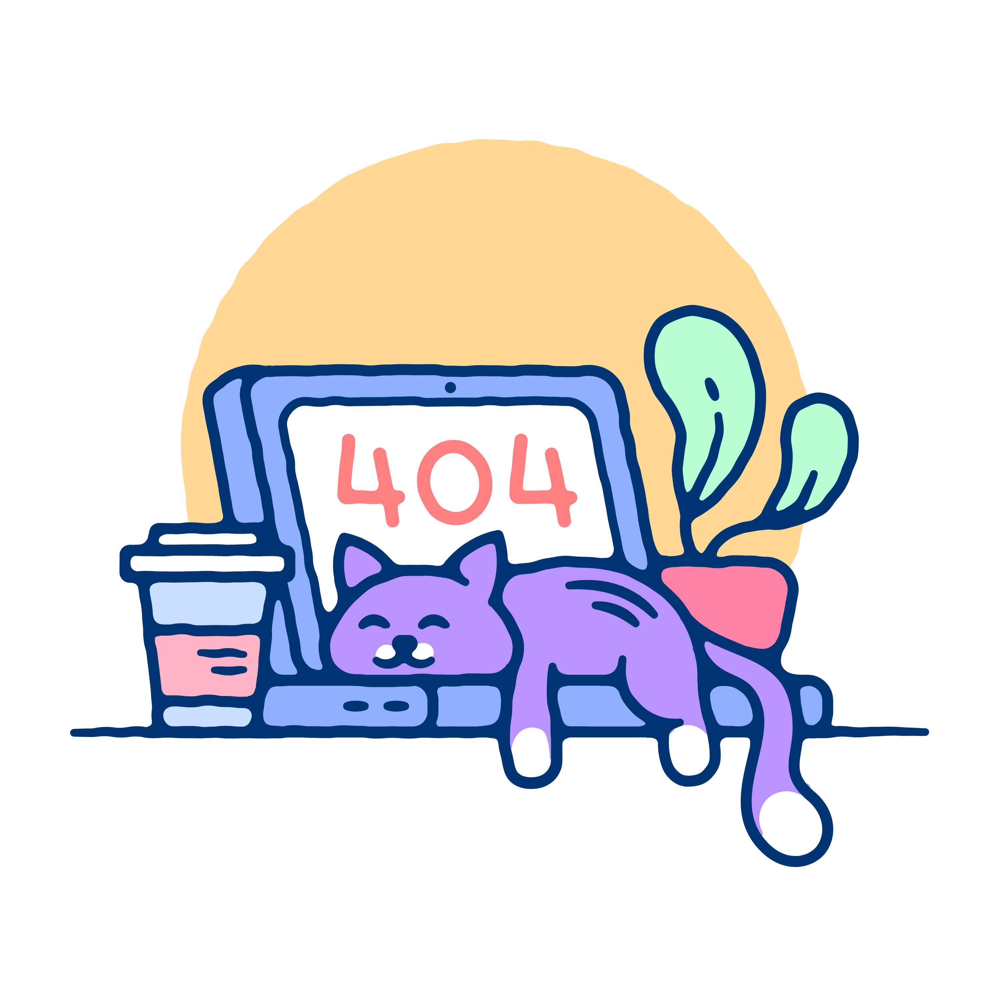

<a name="readme-top"></a>

<!-- PROJECT LOGO -->
<br />
<div align="center">
  <a href="https://github.com/hualuo321/virtual-disks">
    
  </a>
</div>

# Virtual Disks
Go Library for Virtual Disk Development Kit (a.k.a. virtual-disks) 是一个 Golang 包装器，用于访问 VMware 虚拟磁盘开发套件 API (VDDK)，该 API 是一个 SDK，可帮助开发人员创建访问虚拟机上存储的应用程序。

虚拟磁盘为用户提供两级API：

* 低级 API，直接在 Golang 中公开所有 VDDK API。
* 高级 API，为用户提供一些常用的功能，例如 IO 读写。

用户可以选择通过高级 API 使用主要功能，或者使用低级 API 来实现自己的功能组合。

# Dependency
Virtual-disks 需要 Virtual Disk Development Kit (VDDK) 才能与 vSphere 连接。

可以从此处下载 VDDK：[https://code.vmware.com/web/sdk/7.0/vddk](https://code.vmware.com/web/sdk/7.0/vddk)。虚拟磁盘需要 7.0.0 VDDK 版本。

安装完成后，解压到 `/usr/local/` 目录：
```shell
> cd /usr/local

> sudo tar xzf <path to VMware-vix-disklib-*version*.x86_64.tar.gz>.
```

VDDK 可免费供个人和内部使用。重新分发需要免费许可证，请联系 VMware
获得许可证。

下面列出了所需的 Linux 库包：

Ubuntu:
* libc6
* libssl1.0.2
* libssl1.0.0
* libssl-dev
* libcurl3
* libexpat1-dev
* libffi6
* libgcc1
* libglib2.0-0
* libsqlite3-0
* libstdc++6
* libxml2
* zlib1g

Centos:
* openssl-libs
* libcurl
* expat-devel
* libffi 
* libgcc 
* glib2 
* sqlite
* libstdc++
* libxml2
* zlib

# Use cases
Virtual-disks 提供对 virtual disks 的访问, 为应用程序供应商提供一系列用例，包括：
* 备份与虚拟机关联的特定卷或所有卷。
* 获取 vmbk 文件的 IO Reader 和 Writer。
* 将备份代理连接到 vSphere 并备份存储集群上的所有虚拟机。
* 操作 virtual disks 以进行碎片整理、扩展、转换、重命名或缩小文件系统映像。
* 将子磁盘链附加到父磁盘链。

在虚拟机备份中，获取 vmbk 文件的 IO Reader 和 Writer 主要用于读取虚拟机备份数据并将其写入备份存储目标。
1. 读取备份数据（IO Reader）：
	- 读取虚拟机的磁盘镜像数据：IO Reader 会读取虚拟机的磁盘数据，包括虚拟机的主磁盘和任何附加磁盘。
	- 读取虚拟机配置信息：IO Reader 还可能读取虚拟机的配置信息，例如虚拟机的硬件设置、网络配置等。
2. 写入备份数据（IO Writer）：
	- 将备份数据写入备份存储目标：IO Writer 用于将从虚拟机读取的数据写入备份存储设备，例如磁盘、云存储等。
	- 组织备份数据：IO Writer 负责将备份数据按照特定的备份格式或协议进行组织和写入，以确保备份数据的完整性和可还原性。

在虚拟机备份中，将子磁盘链附加到父磁盘链是一种备份策略，通常用于创建完整的虚拟机备份。
1. 创建完整备份：虚拟机通常包含一个主虚拟磁盘和多个附加虚拟磁盘。将子磁盘链附加到父磁盘链可以确保备份包含了虚拟机的所有数据。
2. 数据一致性：通过将子磁盘链附加到父磁盘链，可以确保备份捕获了虚拟机中所有磁盘的一致状态，避免了恢复虚拟机时数据不一致的问题。
3. 简化备份管理：只需要备份一个完整的虚拟机实例，而不是分别备份每个磁盘。
4. 快速还原：当需要还原虚拟机时，备份包含了所有磁盘的完整镜像，可以更快速地还原整个虚拟机。

# Low level API
## Set up
### Init
```$xslt
/**
 * 初始化库。
 * 必须在程序开始时调用，每个进程只应调用一次，应在程序结束时调用 Exit 进行清理。
 */
func Init(majorVersion uint32, minorVersion uint32, dir string) VddkError {}
```
### PrepareForAccess
```$xslt
/**
 * 通知主机不要重新定位虚拟机。
 * 每个 PrepareForAccess 调用都应该有一个匹配的 EndAccess 调用。
 */
func PrepareForAccess(appGlobal ConnectParams) VddkError {}
```
### Connect
```$xslt
/**
 * 将库连接到本地/远程服务器。
 * 始终在程序结束之前调用 Disconnect，这会使任何打开的文件句柄无效。
 * VixDiskLib_PrepareForAccess 应在每次连接之前调用。
 */
func Connect(appGlobal ConnectParams) (VixDiskLibConnection, VddkError) {} 
```
### ConnectEx
```$xslt
/**
 * 创建传输 context 以访问属于特定虚拟机的特定快照的磁盘。
 * 使用此传输 context，调用者可以使用可用于托管虚拟机的最高效的数据访问协议来打开虚拟磁盘，从而提高 I/O 性能。 
 * 如果您使用此调用而不是 Connect()，则应提供额外的输入参数 Transportmode 和 snapshotref。
 */
func ConnectEx(appGlobal ConnectParams) (VixDiskLibConnection, VddkError) {}
```
## Disk operation
### Create a local or remote disk
```$xslt
/**
 * 连接到主机后，在本地创建一个新的虚拟磁盘。
 * 在 createParams 中，您必须指定磁盘类型、适配器、硬件版本和容量（以扇区数表示）。
 * 对于托管磁盘，首先创建托管类型虚拟磁盘，然后使用 Clone() 将虚拟磁盘转换为托管磁盘。
 */
func Create(connection VixDiskLibConnection, path string, createParams VixDiskLibCreateParams, progressCallbackData string) VddkError {}
```
### Open a local or remote disk
After the library connects to a workstation or server, Open opens a virtual disk. With SAN or HotAdd transport, opening a remote disk for writing requires a pre-existing snapshot. Use different open flags to modify the open instruction:
* VIXDISKLIB_FLAG_OPEN_UNBUFFERED – Disable host disk caching.
* VIXDISKLIB_FLAG_OPEN_SINGLE_LINK – Open the current link, not the entire chain (hosted disk only).
* VIXDISKLIB_FLAG_OPEN_READ_ONLY – Open the virtual disk read-only.
* VIXDISKLIB_FLAG_OPEN_COMPRESSION_ZLIB – Open for NBDSSL transport, zlib compression.
* VIXDISKLIB_FLAG_OPEN_COMPRESSION_FASTLZ – Open for NBDSSL transport, fastlz compression.
* VIXDISKLIB_FLAG_OPEN_COMPRESSION_SKIPZ – Open for NBDSSL transport, skipz compression.

Should have a matching VixDiskLib_Close.
```$xslt
/**
 * Opens a virtual disk.
 */
func Open(conn VixDiskLibConnection, params ConnectParams) (VixDiskLibHandle, VddkError) {}
```
### Read and Write disk IO
```$xslt
/**
 * This function reads a range of sectors from an open virtual disk.
 */
func Read(diskHandle VixDiskLibHandle, startSector uint64, numSectors uint64, buf []byte) VddkError {}
```
```$xslt
/**
 * This function writes to an open virtual disk.
 */
func Write(diskHandle VixDiskLibHandle, startSector uint64, numSectors uint64, buf []byte) VddkError {}
```
### Metadata handling
```$xslt
/**
 * Read Metadata key from disk.
 */
func ReadMetadata(diskHandle VixDiskLibHandle, key string, buf []byte, bufLen uint, requiredLen uint) VddkError {}
```
```$xslt
/**
 * Get metadata table from disk.
 */
func GetMetadataKeys(diskHandle VixDiskLibHandle, buf []byte, bufLen uint, requireLen uint) VddkError {}
```
```$xslt
/**
 * Write metadata table to disk.
 */
func WriteMetadata(diskHandle VixDiskLibHandle, key string, val string) VddkError {}
```
### Block allocation
```$xslt
/**
 * Determine allocated blocks.
 */
func QueryAllocatedBlocks(diskHandle VixDiskLibHandle, startSector VixDiskLibSectorType, numSectors VixDiskLibSectorType, chunkSize VixDiskLibSectorType) ([]VixDiskLibBlock, VddkError) {}
```
## Shut down
All virtual disk api applications should call these functions at the end of program.
### Disconnect
```$xslt
/**
 * Destroy the connection. Match to Connect.
 */
func Disconnect(connection VixDiskLibConnection) VddkError {}
```
### EndAccess
```$xslt
/**
 * Notifies the host that a virtual machine’s disk have been closed, so operations that 
 * rely on the virtual disks to be closed, such as vMotion, can now be allowed. Internally
 * this function re-enables the vSphere API method RelocateVM_Task.
 */
func EndAccess(appGlobal ConnectParams) VddkError {}
```
### Exit
```$xslt
/** 
 * Releases all resources held by VixDiskLib.
 */
func Exit() {}
```
# High level API and data structure
## API
### Open
```$xslt
/**
 * Will handle the set up operations for a disk, 
 * including prepare for access, connect, open. If 
 * failure happens in the set up stage, will roll 
 * back to initial state. Return a DiskReaderWriter 
 * which allows read or write operations to the 
 * disk.
 */
func Open(globalParams disklib.ConnectParams, logger logrus.FieldLogger) 
                  (DiskReaderWriter, disklib.VddkError) {}
```
### Read
```$xslt
/**
 * Read reads up to len(p) bytes into p. It returns 
 * the number of bytes read (0 <= n <= len(p)) and 
 * any error encountered.
 */
func (this DiskReaderWriter) Read(p []byte) (n int, err error) {}
```
### ReadAt
```$xslt
/** 
 * Read from given offset.
 */
func (this DiskReaderWriter) ReadAt(p []byte, off int64) (n int, err error) {}
```
### Write
```$xslt
/**
 * Write writes len(p) bytes from p to the 
 * underlying data stream. It returns the number of 
 * bytes written from p (0 <= n <= len(p)).
 */
func (this DiskReaderWriter) Write(p []byte) (n int, err error) {}
```
### WriteAt
```$xslt
/**
 * Write from given offset.
 */
func (this DiskConnectHandle) WriteAt(p []byte, off int64) (n int, err error) {}
```
### Block allocation
```$xslt
/**
 * Determine allocated blocks.
 */
func (this DiskReaderWriter) QueryAllocatedBlocks(startSector disklib.VixDiskLibSectorType, numSectors disklib.VixDiskLibSectorType, chunkSize disklib.VixDiskLibSectorType) ([]disklib.VixDiskLibBlock, disklib.VddkError) {}
```
### Close
```$xslt
/**
 * Clear up all the resources held. Should be called in the end.
 */
func (this DiskReaderWriter) Close() error {} 
```
## Data structure
### DiskReaderWriter
```$xslt
type DiskReaderWriter struct {
	readerAt io.ReaderAt
	writerAt io.WriterAt
	closer   io.Closer
	offset  *int64
	mutex    sync.Mutex                                                                
	logger   logrus.FieldLogger
}
```

# Contributing

The Go Library for Virtual Disk Development Kit project team welcomes 
contributions from the community. If you wish to contribute code and you 
have not signed our contributor license agreement (CLA), our bot will update 
the issue when you open a Pull Request. For any questions about the CLA 
process, please refer to our [FAQ](https://cla.vmware.com/faq).

For additional info on contributing, please see CONTRIBUTING.md
